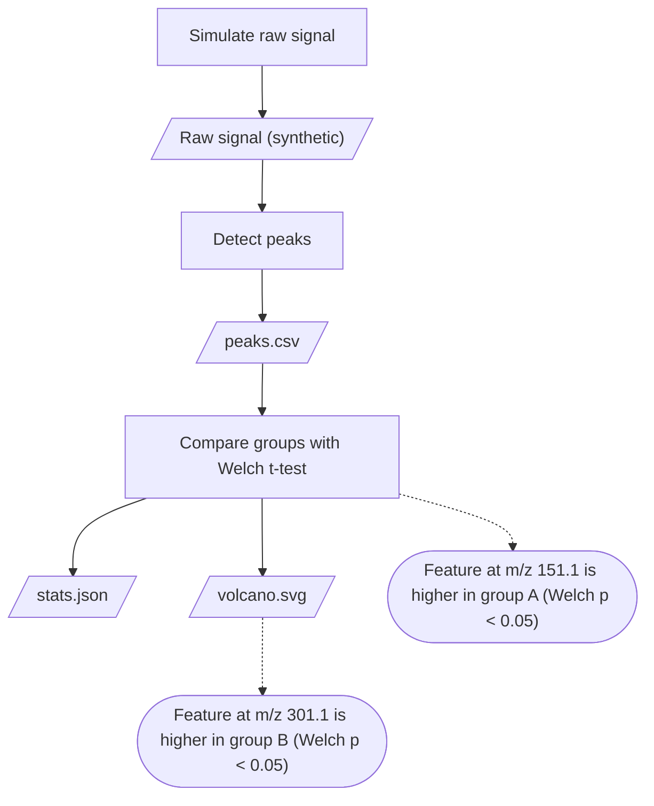

# Analysis graph

Generated 2026-10-27T17:08:16Z by whatran.py/0.3.0. Main path only; rejected branches and unlinked executions are kept in `graph.json`.

```mermaid
flowchart TD
  n0[/"Raw signal (synthetic)"/]
  n1["Simulate raw signal"]
  n4[/"peaks.csv"/]
  n5["Detect peaks"]
  n6[/"stats.json"/]
  n7[/"volcano.svg"/]
  n8["Compare groups with Welch t-test"]
  n9(["Feature at m/z 301.1 is higher in group B (Welch p < 0.05)"])
  n10(["Feature at m/z 151.1 is higher in group A (Welch p < 0.05)"])
  n1 --> n0
  n0 --> n5
  n5 --> n4
  n4 --> n8
  n8 --> n6
  n8 --> n7
  n7 -.-> n9
  n8 -.-> n10
```
